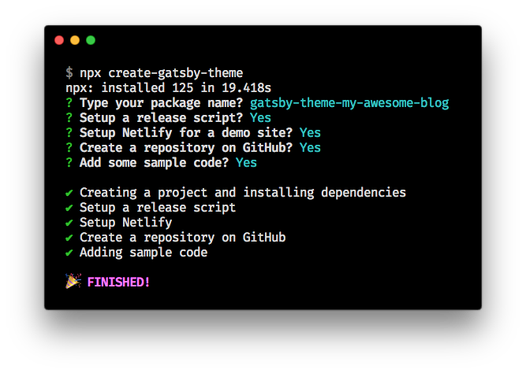

# create-gatsby-theme

Create your own Gatsby theme.

It structures your repository by using `yarn workspace`.

It comes with an example and you can build your theme while testing it on the example, and the example can be used as a demo for your theme later.

## Installation

```bash
npx create-gatsby-theme
```



## Usage

### Sample Code

If you said "Yes" to `Adding sample code`, there should be minimum code to see how it's done. They're not committed into your repository. You can get rid of them by running the following command:

```bash
git reset --hard HEAD && git clean -fd
```

### Running example site

The following command runs the example site.

You can work on both theme and example site and will check it live on the running example site.

```bash
yarn run example
```

### Release your theme

The release process is powered by [Ship.js](https://github.com/algolia/shipjs).

Especially if you maintain multiple packages, this makes it easy to manage all the releases.

To start a release process, run the following command:

```bash
yarn run release:prepare
```

To finish the setup of the release process, please refer to the [Ship.js guide](https://github.com/algolia/shipjs/blob/master/GUIDE.md#automate-part-3-shipjs-trigger-on-your-ci).

### Netlify

If you opted in, `netlify.toml` is added to your repository. By default, it will allow Netlify to build and release your example site. This site can be used as a demo on the README.md of your theme repository.
